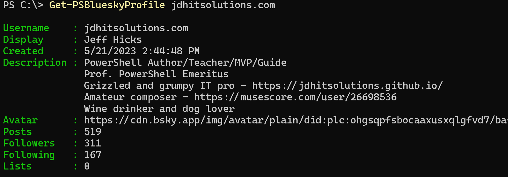

# PSBluesky

__This module is a work in progress. Expect things to change__

This PowerShell module is a set of PowerShell functions designed to let you interact with Bluesky API from PowerShell. Technically, the module commands are wrappers around the [atproto protocols](https://docs.bsky.app/docs/category/http-reference).

The module is written for PowerShell 7, although it might work as written in Windows PowerShell or with minimal changes.

## Authentication

In order to send data, you must authenticate. The `Get-PSBlueskyAccessToken` function will retrieve an access token. You shouldn't need to call this command directly. The other module commands will call it and pass the authentication token as needed. Technically, the token has a time limit and it could be re-used. But it is just as easy to get a token with each request since it is assumed you will be using the module commands intermittently.

You will need to create a PSCredential object with your Bluesky username and password. For automation purposes, you can use the Secrets management module to store your credential. Write your own code to retrieve the credential and pass it to the module commands. You might want to use `PSDefaultParameterValues` to set the credential for all commands.

```powershell
$PSDefaultParameterValues['*-PSBluesky*:Credential'] = $BlueskyCredential
```

## Posting

Use `New-PSBlueskyPost` or its alias `skeet` to post a message to Bluesky. There are parameter to include an image. If you include an image, the `New-PSBlueskyPost` command will call `Add-PSBlueskyImage` to upload the image. It is recommended that you included ALT text for the image.

```powershell
New-PSBlueskyPost -Message "Getting close to sharing my #PowerShell Bluesky code. I'm assuming a few of you are interested." -ImagePath C:\work\MsPowerShell.jpg -ImageAlt "Ms. PowerShell" -Verbose
```

The output is a URL to the post.

## Profiles

The module has a command to retrieve a Bluesky profile.

```powershell
Get-PSBlueskyProfile jdhitsolutions.com
```

]

## Roadmap

I have a short list of items to finish before this can be published to the PowerShell Gallery.

- help documentation
- custom formatting of the profile output
- localize verbose and other messaging

If you are testing the module and think you've found a bug, please post an [Issue\(https://github.com/jdhitsolutions/PSBlueSky/issues). For all other topics and questions, please use the [Discussions](https://github.com/jdhitsolutions/PSBlueSky/discussions) feature.

