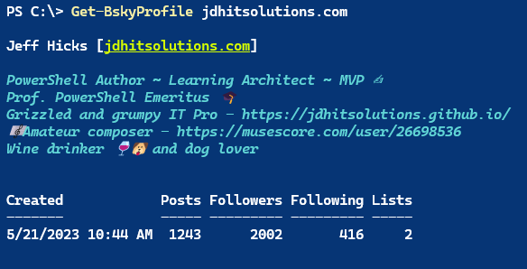

# PSBluesky


[](https://www.powershellgallery.com/packages/PSBluesky/) [](https://www.powershellgallery.com/packages/PSBluesky/)

This module is a set of PowerShell functions designed to let you interact with the Bluesky API from a PowerShell session. Technically, the module commands are wrappers around the [AT protocol](https://docs.bsky.app/docs/category/http-reference). The module is written for *__PowerShell 7__*, although it might work as written in Windows PowerShell with minimal changes if you wish to fork the GitHub repository. Commands *have not* been thoroughly tested for cross-platform compatibility, so please post an [Issue](https://github.com/jdhitsolutions/PSBlueSky/issues) if you encounter a problem.

The commands in this module are __not__ intended to provide complete coverage of the Bluesky API or user experience. Instead, the module focuses on the most common tasks you might want to do with Bluesky from a PowerShell prompt.

For best results, you should run this module in a PowerShell console that supports emojis and ANSI formatting like Windows Terminal.

## Installation

You can install the module from the PowerShell Gallery.

```powershell
Install-Module -Name PSBluesky
```

Or using `Install-PSResource` from the [Microsoft.PowerShell.PSResourceGet](https://go.microsoft.com/fwlink/?LinkId=828955) module.

```powershell
Install-PSResource -Name PSBluesky -Repository PSGallery -TrustRepository
```

You might want to also install the following or related modules to securely store your Bluesky credentials:

- [Microsoft.PowerShell.SecretManagement]( https://github.com/powershell/secretmanagement)
- [Microsoft.PowerShell.SecretStore](https://github.com/powershell/secretstore)

## Module Information

After installing this module, you should end up with these PSBluesky commands:

|         |         |         |
|---------|---------|---------|
| [Add-BskyImage](docs/Add-BskyImage.md) | [Block-BskyUser](docs/Block-BskyUser.md) | [Disable-BskyLogging](docs/Disable-BskyLogging.md) |
| [Enable-BskyLogging](docs/Enable-BskyLogging.md) | [Export-BskyPreference](docs/Export-BskyPreference.md) | [Find-BskyPost](docs/Find-BskyPost.md) |
| [Find-BskyUser](docs/Find-BskyUser.md) | [Format-SpectreConsole](docs/Format-SpectreConsole.md) | [Get-BskyAccountDID](docs/Get-BskyAccountDID.md) |
| [Get-BskyBlockedList](docs/Get-BskyBlockedList.md) | [Get-BskyBlockedUser](docs/Get-BskyBlockedUser.md) | [Get-BskyFeed](docs/Get-BskyFeed.md) |
| [Get-BskyFollowers](docs/Get-BskyFollowers.md) | [Get-BskyFollowing](docs/Get-BskyFollowing.md) | [Get-BskyKnownFollowers](docs/Get-BskyKnownFollowers.md) |
| [Get-BskyLiked](docs/Get-BskyLiked.md) | [Get-BskyLogging](docs/Get-BskyLogging.md) | [Get-BskyModuleInfo](docs/Get-BskyModuleInfo.md) |
| [Get-BskyNotification](docs/Get-BskyNotification.md) | [Get-BskyPreference](docs/Get-BskyPreference.md) | [Get-BskyProfile](docs/Get-BskyProfile.md) |
| [Get-BskySession](docs/Get-BskySession.md) | [Get-BskyStarterPack](docs/Get-BskyStarterPack.md) | [Get-BskyStarterPackList](docs/Get-BskyStarterPackList.md) |
| [Get-BskyTimeline](docs/Get-BskyTimeline.md) | [New-BskyFollow](docs/New-BskyFollow.md) | [New-BskyPost](docs/New-BskyPost.md) |
| [Open-BskyHelp](docs/Open-BskyHelp.md) | [Publish-BskyPost](docs/Publish-BskyPost.md) | [Remove-BskyFollow](docs/Remove-BskyFollow.md) |
| [Remove-BskyLogging](docs/Remove-BskyLogging.md) | [Remove-BskyPreferenceFile](docs/Remove-BskyPreferenceFile.md) | [Set-BskyLogging](docs/Set-BskyLogging.md) |
| [Set-BskyPreference](docs/Set-BskyPreference.md) | [Start-BSkySession](docs/Start-BSkySession.md) | [Unblock-BskyUser](docs/Unblock-BskyUser.md) |
| [Update-BskySession](docs/Update-BskySession.md) | [](docs/.md) | [](docs/.md) |

### Open-BskyHelp

After importing the module you can run [`Open-BskyHelp`](docs/Open-BskyHelp.md) which will open a PDF version of this document in the default application associated with PDF files. Note that not all emojis will render properly in the PDF. Or you can use the -`AsMarkdown` parameter to read this file using markdown formatting. Not all Markdown features may properly render in the console.

### Get-BskyModuleInfo

You can use [`Get-BskyModuleInfo`](docs/Get-BskyModuleInfo.md) to get a summary of the module. The default output includes clickable links to online command help and the module's GitHub repository.

```dos
PS C:\> Get-BskyModuleInfo

   Module: PSBlueSky [v2.7.0]

Name                      Alias               Synopsis
----                      -----               --------
Add-BskyImage                                 Upload an image to Bluesky.
Block-BskyUser                                Block a Bluesky user account.
Disable-BskyLogging                           Disable BlueSky API logging.
Enable-BskyLogging                            Enable BlueSky API logging.
Export-BskyPreference                         Export PSBlueSky preference
                                              settings.
Find-BskyPost             bsf,Search-BskyPost Find Bluesky posts.
Find-BskyUser             bsu                 Search for Bluesky user accounts.
Format-SpectreConsole     Format-Bsky,fsc     Format PSBluesky output for
                                              SpectreConsole.
Get-BskyAccountDID                            Resolve a Bluesky account name to
                                              its DID.
Get-BskyBlockedList       bsblocklist         Get your subscribed blocked lists.
Get-BskyBlockedUser       bsblock             Get your blocked accounts.
Get-BskyFeed              bsfeed              Get your Bluesky feed.
Get-BskyFollowers         bsfollower          Get your Bluesky followers.
Get-BskyFollowing         bsfollow            Get Bluesky accounts you follow.
Get-BskyKnownFollowers                        Get known Bluesky followers
Get-BskyLiked             bsliked             Get your liked Bluesky posts.
Get-BskyLogging                               Getting PSBlueSky logging
                                              settings.
Get-BskyModuleInfo                            Get a summary of the PSBlueSky
                                              module.
Get-BskyNotification      bsn                 Get Bluesky notifications.
Get-BskyPreference                            Get PSBlueSky formatting
                                              preferences.
Get-BskyProfile           bsp                 Get a Bluesky profile.
Get-BskySession           bss                 Show your current Bluesky session.
Get-BskyStarterPack       bssp                Get Bluesky starter packs.
Get-BskyStarterPackList   bssplist            Get a Bluesky starter pack list.
Get-BskyTimeline          bst                 Get your Bluesky timeline.
New-BskyFollow            Follow-BskyUser     Follow a Bluesky user.
New-BskyPost              skeet               Create a Bluesky post.
Open-BskyHelp             bshelp              Open the PSBluesky help document.
Publish-BskyPost          Repost-BskyPost     Repost or quote a Bluesky post.
Remove-BskyFollow         Unfollow-BskyUser   Unfollow a Bluesky user.
Remove-BskyLogging                            Remove the PSBlueSky API log file.
Remove-BskyPreferenceFile                     Delete a PSBlueSky preference
                                              file.
Set-BskyLogging                               Configure PSBlueSky API logging.
Set-BskyPreference                            Set a PSBlueSky formatting
                                              preference.
Start-BSkySession                             Start a new Bluesky session.
Unblock-BskyUser                              Unblock a Bluesky user account.
Update-BskySession        Refresh-BskySession Refresh the Bluesky session token.
```

The output will include clickable links to the online help for each command.

## Authentication

### Session and Tokens

:coin: In order to send data, you must authenticate. Version 2.0.0 of this module introduced a new session model. After you import the module, you __must run__ `Start-BskySession` to initialize the module and setup module-scoped variables.

```powershell
Start-BskySession -credential $cred
```

The credential must be a PSCredential object representing your Bluesky username (handle) and password. (*See below*)

This command will create a hidden session object that will be called from other module commands to get the necessary authentication token for the `Invoke-ResetMethod` header. The access token has a limited lifetime unless it is refreshed. Beginning with version 2.4.0, the module will refresh the token every 60 minutes through a background runspace using a synchronized hashtable. If you remove the module, the runspace will be removed as well.

Run `Get-BskySession` to see your current session information.

```dos
PS C:\> Get-BskySession

   User: jdhitsolutions.com

Active AccessToken             RefreshToken            Age
------ -----------             ------------            ---
True   eyJ0eXAiOiJhdCtqd3Qi... eyJ0eXAiOiJyZWZyZXNo... 00:05:41.5115796
```

If you want to manually test the Bluesky API in your own code, you can use the access and refresh token properties from this object.

```dos
PS C:\> $bskySession = Get-BskySession
PS C:\> $access = $bskySession.AccessToken
PS C:\> $refresh = $bskySession.RefreshToken
```

However, it is still possible you will encounter an expired token error message. If you do, you can run `Update-BskySession` to refresh the token.

```powershell
Get-BSkySession | Update-BskySession
```

If this also fails, remove the module, re-import and start a new Bluesky session, including re-running `Start-BskySession`.

### Credentials :passport_control:

You will need to create a PSCredential object with your Bluesky username and password. __The username is case-sensitive__. For automation purposes, you can use the Secrets management module to store your credential. Write your own code to retrieve the credential and pass it to the module commands.

You might want to use `PSDefaultParameterValues` to set the credential for all commands.

```powershell
$PSDefaultParameterValues['*-Bsky*:Credential'] = $BlueskyCredential
```

You should only need this credential for `Start-BskySession`.

__This module does not support 2FA. You must use an app password__.

### App Passwords :key:

While this module does not use your credential object for anything other than establishing a Bluesky session, you may elect to take a more secure approach and use an app password. This password can be revoked at any time without affecting your main account password. Follow these steps if you want to use an app password with this module.

In the Bluesky app, go to your profile and select `Settings`. Then select `App Passwords`.


You will need to create a new app password. Give it a meaningful name.


Click the button to create the app password.


You will only see the password once. Copy the password and save it in a secure location such as a secrets management vault.

Next, you need to create a credential object in PowerShell. The user name will be the DID (decentralized identifier) for your account. The password will be the app password you just created. You can run `Get-BskyAccountDID` to get your DID. This command does not require authentication.

```powershell
$did = Get-BskyAccountDID jdhitsolutions.com
```

Now you can create a credential object.

```dos
PS C:\> $cred = Get-Credential $did

PowerShell credential request
Enter your credentials.
Password for user did:plc:ohgsqpfsbocaaxusxqlgfvd7:
```

Enter the app password. You will use this credential object with `Start-BskySession`. I recommend you save the credential in a secrets management vault and retrieve it when you need to start a Bluesky session.

```powershell
$cred = Get-Secret -Name PSBlueskyCredential
$PSDefaultParameterValues['*-*Sky*:Credential'] = $cred
```

You can revoke an app password at any time. If you do, you will need to create a new app password and update your credential object.

:sparkle: __I recommend you use an app password with this module and protect your primary account password. If your Bluesky account is protected with 2FA, you *must* use an app password with this module.__

## Rate Limits

The commands in this module use the public Bluesky API which means there are [rate limits](https://docs.bsky.app/docs/advanced-guides/rate-limits). If you exceed the rate limit, you will get an error message. You will need to wait until the rate limit resets.

:warning: There is a rate limit of 300 new sessions per day. This shouldn't be an issue for most people unless you are testing code or running some sort of high-volume automation.

## :email: Posting

Use `New-BskyPost`, or its alias `skeet`, to post a message to Bluesky. There are parameters to include an image. If you include an image, the `New-BskyPost` command will call `Add-BskyImage` to upload the image. Beginning with v2.7.0, you must provide ALT text if you upload an image.

```powershell
$param = @{
    Message   = "Getting close to sharing my #PowerShell Bluesky code."
    ImagePath = "C:\work\MsPowerShell.jpg"
    ImageAlt  = "Ms. PowerShell"
    Verbose   = $true
}
New-BskyPost @param
```

The output is a URL to the post.

If your message contains a URL, it will be converted to a clickable link. Make sure your link is surrounded by white space. Beginning with v1.0.0, you can post Markdown style links.

```dos
PS C:\> $m = "Testing multiple Markdown style links from my [#PowerShell
PSBluesky module](https://github.com/jdhitsolutions/PSBluesky) which you
can find on the [PowerShell Gallery](https://www.powershellgallery.com/
packages/PSBlueSky/0.6.0)"
PS C:\> skeet $m
```


This example is using the `skeet` alias for `New-BskyPost`.

### Emojis

:writing_hand: You can include emojis in your post, however use with caution. If your post is nothing but text with an emoji or two, you shouldn't encounter any issues. However, if you mix emojis with tags or links, the posted message might not display the tags or links properly. Inserting tags and links requires calculations using the line length. Some emojis may throw off the calculations.

### Multi-Line Posts

The command will strip off any Unicode control characters except for a new line. If you would like to create a multi-line post, using a here-string is recommended.

```powershell
PS C:\> $s= @"
I am amazed that the [PSBluesky](https://github.com/jdhitsolutions/PSBluesky)
module has almost 7K downloads. I started throwing things together only three
months ago.

Thank you.

#PowerShell
"@
PS C:\> skeet $s -ImagePath C:\scripts\PSBluesky\images\BlueskyLogo-icon.png
-ImageAlt "Bluesky logo"
```

This example uses the alias `skeet` for `New-BskyPost`.

### Reposting and Quoting

You can repost or quote a Bluesky post with `Publish-BskyPost`. You will need the CID and AT Uri (URI) of the post you want to repost or quote. These values should be part of items you can get with commands like `Get-BskyFeed` or `Get-BskyTimeline`.

```dos
PS C:\> Get-BskyTimeline -Limit 1 | Select-Object *

Author        : joeydantoni.com
AuthorDisplay : Joey D'Antoni
Date          : 1/9/2025 12:11:13 PM
Text          : I would likely denormalize the data a little bit, and
                have a non-vector table with ref. data like date that
                you could filter on, before doing the heavier lifting
                of the vector query. Almost like a fact/dim join in a
                DW. learn.microsoft.com/en-us/sample... cc
                @mauridb.bsky.social for a better example
Liked         : 0
Reposted      : 0
Quoted        : 0
URL           : https://bsky.app/profile/did:plc:3dvxs53kzjez5oxcbucfsa
                cf/post/3lfd6cfv7hs2o
URI           : at://did:plc:3dvxs53kzjez5oxcbucfsacf/app.bsky.feed.post
                /3lfd6cfv7hs2o
CID           : bafyreih7yplygqrno2n3n5mhqs35fbwqovxsvc6xrictt4afzgnwrt7
                epi
```

The easiest way to repost or quote a post is to pipe the object to `Publish-BskyPost`.


This example assumes that `$tl` is an array of objects from `Get-BskyTimeline`. If you don't specify a quote, the command will repost the original message. If you do specify a quote, the command will quote the original message.

```powershell
$f[-4] | Publish-BskyPost -Quote "Testing quoting with a PSBluesky command"
```

The command has an alias of `Repost-BskyPost`. If you include quote text, the post will be a quote, otherwise it will show as a repost from you.

## Profiles

The module has a command to retrieve a Bluesky profile.

```powershell
Get-BskyProfile jdhitsolutions.com
```

The module uses a custom format file.



The user's profile name should be a clickable link.

The object has been customized with aliases and script properties.

```dos
PS C:\> $jeff = Get-BskyProfile
PS C:\> $jeff | Select-Object *

Username    : jdhitsolutions.com
Display     : Jeff Hicks
Created     : 5/21/2023 10:44:48 AM
Description : PowerShell Author ~ Learning Architect ~ MVP ✍️
              Prof. PowerShell Emeritus 🎓
              Grizzled and grumpy IT Pro - https://jdhitsolutions.github.io/
              🎼Amateur composer - https://musescore.com/user/26698536
              Wine drinker 🍷🐶 and dog lover
Avatar      : https://cdn.bsky.app/img/avatar/plain/did:plc:ohgsqpfsbocaaxusx
              qlgfvd7/bafkreifdfahcjmytu3iw2aj2d3howu6q7twkta3h23qmlve2d2mvo5
              sily@jpeg
Posts       : 1243
Followers   : 2002
Following   : 416
Lists       : 2
URL         : https://bsky.app/profile/jdhitsolutions.com
DID         : did:plc:ohgsqpfsbocaaxusxqlgfvd7
Viewer      : @{muted=False; blockedBy=False; knownFollowers=}
Labels      :
Name        : jdhitsolutions.com
Age         : 618.22:15:32.5068959
```

Note the the `Followers` property may not be 100% accurate. This counter may not properly reflect accounts that have stopped following you. The way that Bluesky is handling bot accounts may also affect this count.

## :couple: Followers

You can retrieve a list of your followers. You can specify a number of followers between 1 and 100. The default is 50.


The custom formatting includes a clickable link to the follower's profile if running in Windows Terminal or a console that supports hyperlinks.

You can pipe the follower object to `Get-BskyProfile` to retrieve more information.

```dos
PS C:\> $f= Get-BskyFollowers
PS C:\> $f[12] | Get-BskyProfile

Jess Pomfret [jpomfret.bsky.social]

Database Engineer with a passion for automation, proper football
and fitness. She/Her.


Created              Posts Followers Following Lists
-------              ----- --------- --------- -----
8/14/2023 3:58:44 PM   125       236       157     1
```

The default behavior is to retrieve between 1 and 100 followers. Or you can use the `-All` parameter to retrieve all followers.

### Known Followers

You can use [`Get-BskyKnownFollowers`](docs/Get-BskyKnownFollowers.md) to retrieve a list of followers that you follow back.


## :telescope: Searching for Users

You can search for Bluesky users with [`Find-BskyUser`](docs/Find-BskyUser.md). The default behavior is to search for a user by name. The search is case-insensitive.

```powershell
Find-BskyUser -UserName "jeff h" -Limit 3
```

The default output includes clickable links to the user's profile. This object too has been customized with aliases and script properties.

```dos
PS C:\> Find-BskyUser -UserName "jeff h" -Limit 2 |
Select-Object *Name,Description,Created,Age

DisplayName : Jeff (no, the other one)
UserName    : jeff-notheotherone.bsky.social
Description : When I use a word, Humpty said, it means just what I choose it to
              mean - neither more nor less.

              The question is, said Alice, whether you can make words mean so
              many different things.

              H: The question is which is to be Master — that's all.
Created     : 8/11/2023 6:27:08 AM
Age         : 514.11:04:04.2416645

DisplayName : Jeff H
UserName    : jhorowitzmd.bsky.social
Description : Division Chief of Pulm, Crit Care and Sleep Med at OSU. Lung
              fibrosis investigator. Cubs. Star Wars, GoT, LoTR, Avengers. Dad,
              husband, son and brother. RT's do not mean endorsement.
              #horoblast.
Created     : 11/13/2024 6:53:06 AM
Age         : 54.10:38:05.3790593
```

The value you specify for the user name will also search the user's description property. This is a handy way of finding users with similar interests.

```powershell
Find-BskyUser powershell
```


You can pipe the search results to `Get-BskyProfile` to retrieve more information.

```dos
PS C:\> $p = Find-BskyUser powershell -Limit 10
PS C:\> $p | Get-BskyProfile

Chrissy LeMaire [funbucket.dev]

Dual Microsoft MVP, GitHub Star, creator of dbatools, author
http://dbatools.io/book 🏳️‍🌈

Totally into PowerShell, SQL Server and AI.

📍 North of France


Created               Posts Followers Following Lists
-------               ----- --------- --------- -----
4/24/2023 12:12:00 PM   688      1435       614     0
...
```

## Following

Likewise, you can get a list of all the accounts you are following.


As with followers, the default behavior is to retrieve between 1 and 100 accounts you are following. Or you can use the `-All` parameter to retrieve all accounts you are following.

Starting with version 2.3.0, you can follow and unfollow Bluesky users with [New-BskyFollow](docs/New-BskyFollow.md) and [Remove-BskyFollow](docs/Remove-BskyFollow.md). These commands can also be referenced by their aliases `Follow-BskyUser` and `Unfollow-BskyUser`.

To follow, specify the account's user name or handle.

```dos
PS C:\> Follow-BskyUser andrewpla.tech
https://bsky.app/profile/did:plc:xrspiwserax6shgskcj7grgg
```

The output is a clickable link to the followed user's profile.

To unfollow, you can pipe a user object to `Remove-BskyFollow`

```dos
PS C:\> Remove-BskyFollow andrewpla.tech -WhatIf
What if: Performing the operation "Remove-BskyFollow" on target "andrewpla.tech".
```

Or you can pipe a user object to `Remove-BskyFollow`.

```dos
PS C:\> Get-BskyProfile andrewpla.tech | Remove-BskyFollow -Passthru

cid                                                         rev
---                                                         ---
bafyreibe4a3ewrh2oty2jercit75q42wdnuuip22b3tq6jybwamdz7daq4 3lfnjoouju62k
```

The followed user will receive a notification when you follow them but not when you unfollow them.

## :no_entry_sign: Blocking

You can block a Bluesky user with `Block-BskyUser`. You will need the user's user name.

```dos
PS C:\> Block-BskyUser -UserName "PooBar1234.bsky.social"
```

You can also pipe follower or profile objects to the command.

```dos
PS C:\> $f[-1] | Block-BskyUser -WhatIf
What if: Performing the operation "Block-BskyUser" on target "thedavecarroll.com
[did:plc:rlwd5iajr3btl5e7gyvfwk67]".
PS C:\> Get-BskyProfile thedavecarroll.com | Block-BskyUser
```

Use `Get-BskyBlockedUser` to see a formatted display.


To unblock is just as easy.

```powershell
Unblock-BskyUser thedavecarroll.com
```

If you subscribe to any block lists, use `Get-BskyBlockedList` to see the list.


The formatted output includes hyperlinks.

## Feed :newspaper:

Use [`Get-BskyFeed`](docs/Get-BskyFeed.md) to retrieve the latest posts from *your* feed. You can query for 1 to 100. The default output uses a custom format file. The current behavior is to get posts and replies.


The formatted output includes clickable links to the the author, which might be different than you if reposting, and the post. For best results, run PowerShell 7 in Windows Terminal.

## Notifications :bell:

You can retrieve your notifications with `Get-BskyNotification`. You can specify a limit of 1 to 100. The default is 50.

```powershell
 Get-BskyNotification -limit 10
 ```

The default formatted output includes clickable links to the author and the liked or reposted skeet.

- :thumbsup: Like
- :arrow_right: Follow
- :arrows_counterclockwise: Repost
- :leftwards_arrow_with_hook:  Reply


Long account names will be truncated in the formatted output.

## Timeline :calendar:

If you want to view items from your timeline, use the `Get-BskyTimeline` command.


You can specify a limit of 1 to 100.The default is 50.

```powershell
Get-BskyTimeline -Limit 25
```

The command uses a custom format file. The default formatted output includes clickable links to the author and the post.

## :mag: Searching for Posts

Module version 2.6.0 introduced an __experimental__ command called [`Find-BskyPost`](docs/Find-BskyPost.md). This command allows you to search for posts using a search term or text. You can limit your search by account name and/or date.

```powershell
Find-BskyPost -query "PSConfEU" -Since "4/1/2025"
```


Default output includes clickable links to the author and the post.

The API used by the command is limited in functionality. For now, there is no way to search for tags. Do not include hashtags in your search query. The command will fail.

## Starter Packs :package:

Module version 2.6.0 added two commands to retrieve starter packs. If you know the owner's account name, you can get information about the starter pack using [Get-BskyStarterPack](docs/Get-BskyStarterPack.md).

```powershell
Get-BskyStarterPack -UserName thedavecarroll.com
```


To get list members, pipe the list object to [Get-BskyStarterPackList](docs/Get-BskyStarterPackList.md).

```powershell
Get-BskyStarterPack -UserName thedavecarroll.com | Get-BskyStarterPackList
```


```dos
PS C:\> PS C:\> $list = Get-BskyStarterPack -UserName thedavecarroll.com | Get-BskyStarterPackList -All
PS C:\> $list.MemberCount
88
PS C:\> $list.members[0..4] | Select DisplayName,Handle,Description

displayName      handle                   description
-----------      ------                   -----------
mdgrs            mdgrs.bsky.social        Hobby Coder who loves PowerShell💻 GameDev at work🕹️…
DSC Community    dsccommunity.bsky.social A collaborative community of authors and maintainers working to improve the …
                 steve--lee.bsky.social
Ryan Yates       blog.kilasuit.org        Founder of @mhasl.me…
SeeminglyScience seeminglyscience.com     Software Engineer for PowerShell at Microsoft
```

## API Logging :file_cabinet:

Beginning with v2.4.0, you can enable API logging. This will allow you to keep track of what API endpoints you are using. You might want to know this information to gauge your usage against API rate limits. Logging is disabled by default when you import the module.

Run `Get-BskyLogging` to see the current logging status.

```dos
PS C:\> Get-BskyLogging

LoggingEnabled LogFile                                              LogFileSize
-------------- -------                                              -----------
         False C:\Users\Jeff\AppData\Local\Temp\bskyAPILogging.json           0
```

To enable logging, run `Enable-BskyLogging`.

```dos
PS C:\> Enable-BskyLogging -Passthru | Select LoggingEnabled

LoggingEnabled
--------------
          True
```

When an Bluesky API request is made, it will be logged to a JSON file. When you enable logging, beginning in version 2.5.0, the command will define a global variable, `$bskyLogFile` which makes it easier to work with the log file.

```dos
PS C:\> Get-Content $bskyLogFile | ConvertFrom-Json | Select-Object -last 2

Date     : 1/27/2025 2:45:02 PM
PID      : 31876
Uri      : https://bsky.social/xrpc/com.atproto.repo.createRecord
Endpoint : com.atproto.repo.createRecord
Name     : createRecord
Command  : New-BskyPost
Host     : ConsoleHost

Date     : 1/27/2025 2:49:51 PM
PID      : 31876
Uri      : https://bsky.social/xrpc/app.bsky.actor.getProfile?actor=jdhitsolutions.com
Endpoint : app.bsky.actor.getProfile
Name     : getProfile
Command  : Get-BskyProfile
Host     : ConsoleHost
```

*If you see a command like `_getPostText` or `RunspaceRefreshSession`, these are private helper functions. Exported module commands follow the verb-noun naming convention.*

It should be easier to work with structured data to analyze usage patterns. The default log is in your `%TEMP%` directory. You can change the log file location `Set-BskyLogging`.

```dos
PS C:\> Set-BskyLogging c:\temp\api.json -WhatIf
What if: Performing the operation "Set-BskyLogging" on target "c:\temp\api.json".
```

If you set the location, this will also update `$bskyLogFile`.

You can disable logging with `Disable-BskyLogging`.

```dos
PS C:\> Disable-BskyLogging
```

If you want to clear the logging file or start over, you can easily delete it.

```dos
PS C:\> Remove-BskyLogging -WhatIf
What if: Performing the operation "Remove File" on target "C:\Users\Jeff\
AppData\Local\Temp\bskyAPILogging.json".
```

Changes you make to logging will persist for the duration of your PowerShell session. The next time you import the module, the default settings will be used and you will need to re-enable logging and/or change the log file location.

The assumption is that logging is a temporary feature to help you troubleshoot or monitor your API usage and thus logging settings are not stored as module preferences.

Logging information is stored in the `BskySession` object, but you should use the module functions to manage it.

## Ad-Hoc Scripting

You can use the PSBluesky module in ad-hoc scripting projects using the [Bluesky API](https://docs.bsky.app/docs/category/http-reference). One common requirement is to provide an authentication header. Since you can use the PSBluesky module to create an authenticated session, you can create a header from this information.

The session object has a script method you can use to create a header.

```dos
PS C:\> $headers = (Get-BskySession).CreateHeader()
PS C:\> $headers

Name                           Value
----                           -----
Content-Type                   application/json
Authorization                  Bearer eyJ0eXAiOiJhdCtqd...
```

During your scripting, if you get an error about an expired token, recreate the headers variable.

Say you want to use the [`actor-get-preferences`](https://docs.bsky.app/docs/api/app-bsky-actor-get-preferences) API. You can define the uri accoriding to the documentation.

```powershell
$PDSHost = "https://bsky.social"
$uri = "$PDSHost/xrpc/app.bsky.actor.getPreferences"
```

Then you can use the `Invoke-RestMethod` cmdlet to make the API call.

```powershell
$r = Invoke-RestMethod -Uri $uri -Method Get -Headers $headers
```

And then work with results.

```dos
PS C:\> $r.preferences

hideReplies             : False
hideRepliesByUnfollowed : False
hideRepliesByLikeCount  : 2
hideReposts             : False
hideQuotePosts          : False
$type                   : app.bsky.actor.defs#feedViewPref
feed                    : home

nuxs  : {@{id=TenMillionDialog; completed=True}, @{id=NeueTypography; completed
        =True}}
$type : app.bsky.actor.defs#bskyAppStatePref
...

PS C:\> $r.preferences[0] | Select hide*

hideReplies             : False
hideRepliesByUnfollowed : False
hideRepliesByLikeCount  : 2
hideReposts             : False
hideQuotePosts          : False
```

Here's another example using the [`get-known-followers`](https://docs.bsky.app/docs/api/app-bsky-graph-get-known-followers) API.

```dos
PS C:\> $uri = "$PDSHost/xrpc/app.bsky.graph.getKnownFollowers?actor=
jdhitsolutions.com&limit=100"
PS C:\> $r = Invoke-RestMethod -Uri $uri -Headers $headers
PS C:\> $r.followers.count
100
PS C:\> $r.followers[-1]

did         : did:plc:h6cd7ej2sl4hswxfyjp6b4mx
handle      : harjit.bsky.social
displayName : Harjit Dhaliwal [Hoorge]
avatar      : https://cdn.bsky.app/img/avatar/plain/did:plc:h6cd7ej2sl4hswxfyj
              p6b4mx/bafkreibb56a7ywrmwqcfn5wj42a473wj375c4l33526xiitch2td3an4
              km@jpeg
associated  : @{chat=}
viewer      : @{muted=False; blockedBy=False;
              following=at://did:plc:ohgsqpfsbocaaxusxqlgfvd7/app.bsky.grap...
              followedBy=at://did:plc:h6cd7ej2sl4hswxfyjp6b4mx/app.bsky.gra...
labels      : {}
createdAt   : 5/1/2023 4:35:34 AM
description : Senior Product Marketing Manager for Cloud Endpoints at Microsoft,
              Ex-Microsoft MVP, IT Pro, Social Media Strategist, Photographer,
              International Speaker, Mentor.

              https://about.me/HarjitDhaliwal
              https://aka.ms/TacklingTech

              #Windows #Microsoft #Copilot
indexedAt   : 11/29/2024 1:28:38 AM
```

## :information_source: Information and Troubleshooting

The commands in this module should write the raw response from the API request to the Information stream. Some commands might include additional information.


The output will be an object.

```dos
PS C:\> $v.MessageData | Select-Object did,handle,*count

did            : did:plc:ohgsqpfsbocaaxusxqlgfvd7
handle         : jdhitsolutions.com
followersCount : 322
followsCount   : 177
postsCount     : 543
```

You might want to set a default parameter value.

```powershell
$PSDefaultParameterValues['*-*Sky*:InformationVariable'] = "iv"
```

## Other Module Features

### Custom Formatting

Many of the commands in this module use custom formatting files to provide a more visually appealing output. The module uses emojis and ANSI formatting. The formatting is designed for Windows Terminal or a console that supports ANSI formatting and emojis.

Some commands will also have alternative format views.


| Command | Format | ViewName  | Description |
|---------|------| ----| -----|
| Get-BskyLiked | Table | Liked | A custom view for liked posts |
| Get-BskyTimeline | Table | Liked | A custom view for liked posts |
| Get-BskyTimeline | Table | Default | An alternate table view |
| Get-BskyFeed | Table | Liked | A custom view for liked posts |
| Get-BskyModuleInfo | List | Default | A custom view for module information |

If you have the [pwshSpectreConsole](https://github.com/ShaunLawrie/PwshSpectreConsole) module installed, it will be detected and used to display images like a user profile picture.


If you do not have the module installed, you'll get the default output.

### Format-SpectreConsole

If you __do__ have the pwshSpectreConsole module installed, you can pipe some commands from the PSBluesky module to `Format-SpectreConsole` to customize the output. The command will attempt to display images and separate out tags and links. The output is intended for viewing in the console. This is a format command so you shouldn't attempt to pipe it to another command.

The command will accept output from these commands:

- Find-BskyPost
- Get-BskyFeed
- Get-BskyFollower
- Get-BskyFollowing
- Get-BskyLiked
- Get-BskyModuleInfo
- Get-BskyProfile
- Get-BskyTimeline


### Type Extensions

You are encourage to pipe command results to `Get-Member` to discover additional properties you might find useful.

```dos
PS C:\> Get-BskyProfile thedavecarroll.com |
Format-List Name,Description,Created,Age

Name        : thedavecarroll.com
Description : #PowerShell #Developer and enthusiast with a side of #DevOps,
              #Python, infrastructure, and
              #RetroComputing. Lifelong #cinephile and #punster.

              #Aspie #INTJ #9w1
              He/Him

              https://thedavecarroll.com
Created     : 4/29/2023 6:52:59 AM
Age         : 633.07:27:20.9929789
```

### Custom Verbose Messaging

This module uses ANSI formatting with localized string data and customized verbose messaging.


The color formatting the command names is not user-configurable at this time.

I am hoping to add localized strings for other languages as well as localizations to command help and the help PDF file.

### Preferences

The module features that rely on custom formatting and ANSI colorization may not be compatible in all console environments or for all users. You may need to adjust settings to improve the display. All formatting preferences are stored in an exported hash table variable called `bskyPreferences`. While you can modify this variable directly, it is recommended that you use the related module commands to manage it.

Run [Get-BskyPreference](docs/Get-BskyPreference.md) to see your current settings.


You can use [Set-BskyPreference](docs/Set-BskyPreference.md) to change them.

```powershell
Set-BskyPreference Username -style "`e[3;38;5;135m"
```

You can use any ANSI sequence or `$PSStyle` value. Any changes you make will only persist for the duration of your PowerShell session or until you remove the PSBluesky module. The next time you import the module, the default preferences will be used. To save your changes, run [`Export-BskyPreference`](docs/Export-BskyPreference.md) to save your preferences to a JSON file under `$HOME`.

```dos
PS C:\> Export-BskyPreference -Passthru

    Directory: C:\Users\Jeff

Mode                 LastWriteTime         Length Name
----                 -------------         ------ ----
-a---           1/13/2025  9:41 AM           1091 .psbluesky-preferences.json
```

The next time you import the module, if this file is present, the module will import it and apply your preferences.

To remove your preferences and restore the module defaults, you can use [Remove-BskyPreferenceFile](docs/Remove-BskyPreferenceFile.md) and then re-import the module. If you decide to uninstall the module, and have exported preferences, you should run this command before uninstalling. Otherwise, you will need to manually delete the file.

## Roadmap :world_map:

I have a short list of items on my wish list:

- Add support for posting video
- Add commands to work with direct messages, aka chat
- Create a TUI-base reader for your timeline

If you are testing the module and think you've found a bug, please post an __[Issue](https://github.com/jdhitsolutions/PSBlueSky/issues)__. For all other topics and questions, including feature requests, please use the repository's __[Discussions](https://github.com/jdhitsolutions/PSBlueSky/discussions)__ section. I am open to pull requests if you have a feature you'd like to add. I especially would love to see the Pester tests expanded and the pending tests completed.

> You can find me on Bluesky as [jdhitsolutions.com](https://bsky.app/profile/jdhitsolutions.com).
